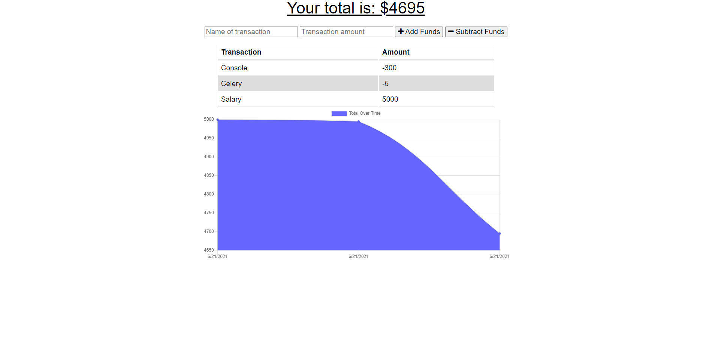

# Online/Offline Budget Trackers

Want to track your spending habits and keep an eye on your finances? Use this simple budget tracker to get the job done! No matter if you are online or offline, this application will keep track of all your transations in a database. 

## Description
This application helps you to track the flow of your money! Add funds and subtract funds as you earn money or spend money. 

Check out the deployed application [here](https://budget-trackers-bootcamp-2021.herokuapp.com/)!

The use of this webpage is very simple. Type in the type of transaction you are putting into the tracker, such as salary, groceries, gas, etc. Put in the amount of the transaction, then click on the "Add Funds" button or the "Subtract Funds" button to either add the transation to your total money, or subtract the transation from your total money. 

This application has a offline feature. Internet goes down or you are working offline? No matter, this application can still keep track of anything you add or subtract to the database. 

When you add a transation, a simple chart will display the trend of your spending and income over time, and the total cost of your money at the top of the screen. This application will also keep track of the type of transactions you have made, and how much money has moved. Use this feature to help you make sure you aren't spending more than you are earning, and what you are spending on!

## Features
- Users can add funds or subtract funds from their total money pool
- Users can see a chart that updates in real-time of their spending and earning habits over time
- Users can see their total amount of money left at the top of the application
- Users can see the history of their transactions, what type of transation it was and how much money was added or subtracted
- Users can work offline. The application will store what they added or subtracted no matter if they are online or offline
- Data is stored in a database for the user